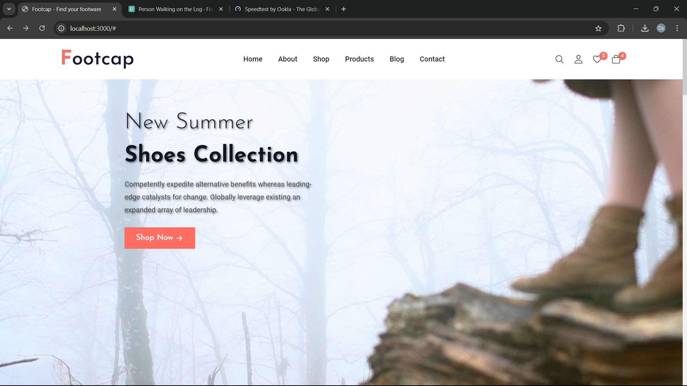
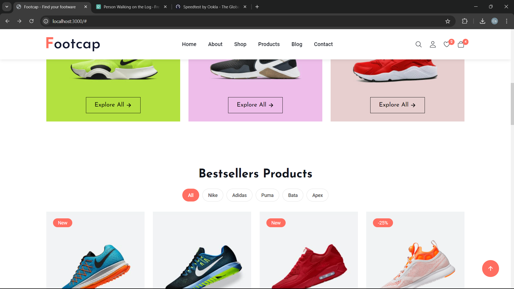
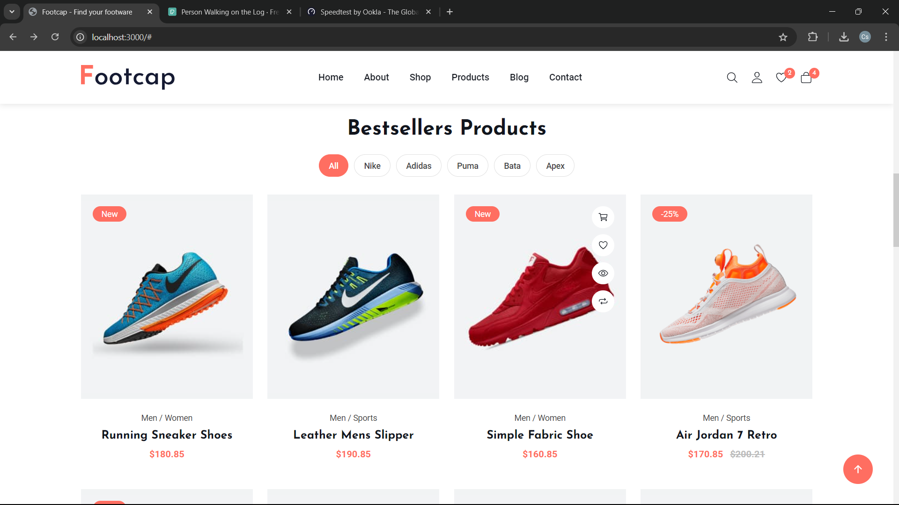
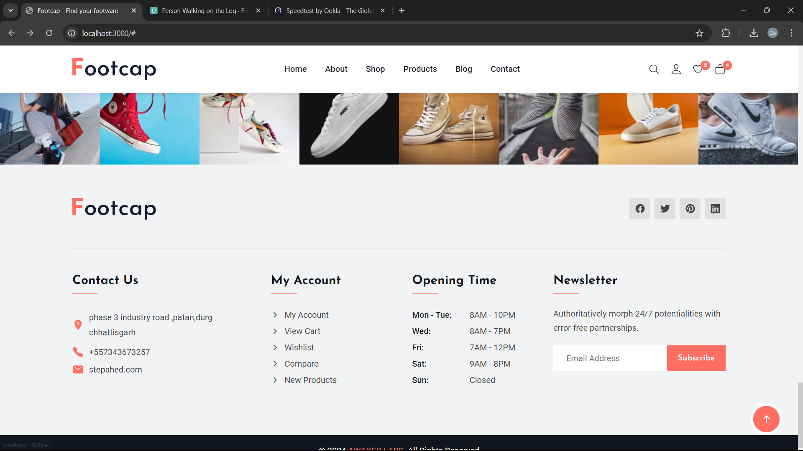
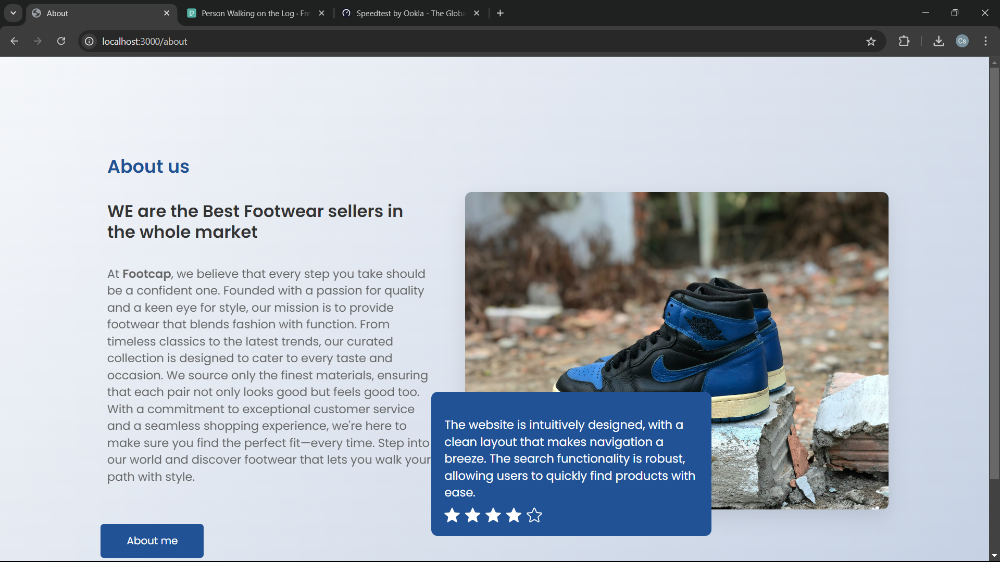
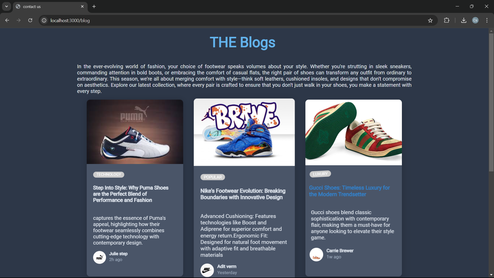
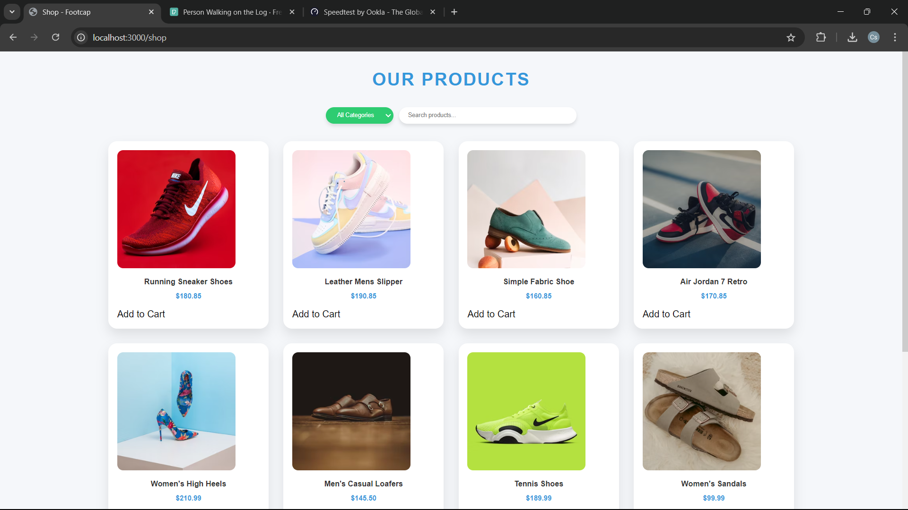
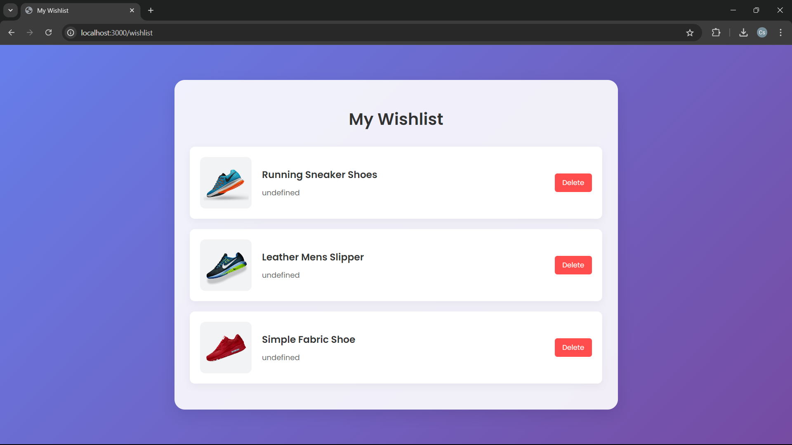
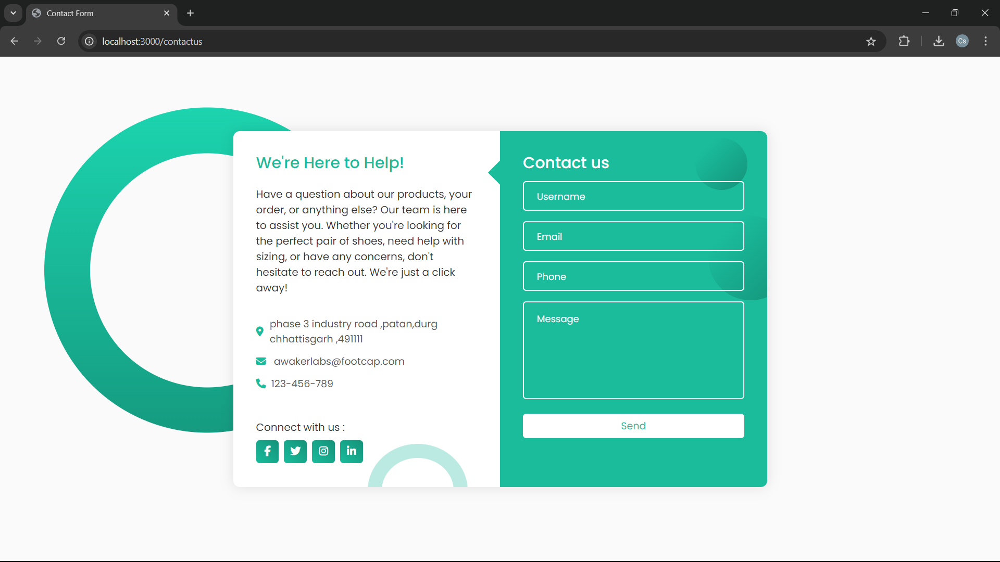
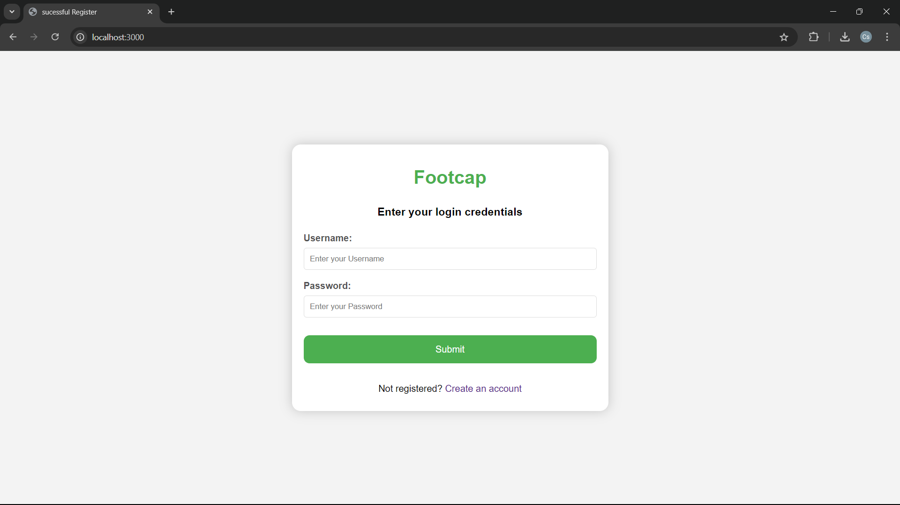

# Footcap - eCommerce Website

A modern, fully responsive footwear eCommerce platform built with MERN stack (MongoDB, Express.js, React.js, Node.js).

## 🚀 Live Demo

[View Live Demo](https://github.com/AdityaVerma126/footwear-ecommerce-website.git)

## 📸 Preview

Click to view screenshots

### Main Pages

### Additional Pages

## ✨ Features

- 📱 Fully responsive design optimized for all devices
- 🛍️ Complete product catalog with:
  - Advanced filtering and sorting
  - Product categories
  - Search functionality
- 🛒 Shopping cart features:
  - Add/remove items
  - Quantity adjustment
  - Price calculation
- 👤 User authentication:
  - Login/Register
  - Profile management
  - Order history
- 💳 Secure checkout process
- 💻 Admin dashboard
- 📦 Real-time inventory management

## 🛠️ Technologies

### Frontend
- HTML5
- CSS3
- JavaScript
- React.js
- Redux (for state management)

### Backend
- Node.js
- Express.js
- MongoDB
- JWT (for authentication)

### Tools & Deployment
- Git
- npm
- REST API
- Responsive Design

## 🚀 Installation

1. Clone the repository
  git clone https://github.com/AdityaVerma126/footwear-ecommerce-website.git

2. Install dependencies
  npm install

3. Start the server
  npm start

4. Start the client
  npm start

The application will be available at `http://localhost:3000`

## 🤝 Contributing

Contributions are always welcome! Here's how you can help:

1. Fork the repository
2. Create your feature branch (`git checkout -b feature/AmazingFeature`)
3. Commit your changes (`git commit -m 'Add some AmazingFeature'`)
4. Push to the branch (`git push origin feature/AmazingFeature`)
5. Open a Pull Request

Please ensure your PR adheres to our coding guidelines.

## 📝 License

This project is private and not licensed for public use.

## 📧 Contact

Aditya Verma - [adityaverma12609@gmail.com](mailto:adityaverma12609@gmail.com)

Project Link: [https://github.com/AdityaVerma126/footwear-ecommerce-website](https://github.com/AdityaVerma126/footwear-ecommerce-website)

---

⭐️ If you found this project helpful, please consider giving it a star!